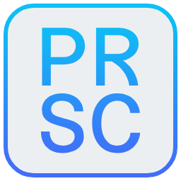

#  screenshot-cpp-mg

Screenshot utility written in C++

## Features

- Persistent region selection
  - Region stays on-screen for adjustment
- Hotkeys
  - Ctrl+S (Save to file)
  - Ctrl+C (Copy to clipboard)
  - Ctrl+Shift+C (Open Preview window)
  - Hotkeys work on the Preview as well
  - R (Reset zoom level in Preview)
  - Shift+R (Reset Preview window size)
- Mark-up on the Preview
  - Includes panning, free draw, and shape draw
  - Enables Undo (Ctrl+Z) and Redo (Ctrl+Y)

## Limitations

- Windows only
  - I'm on Windows 11 build 26200, haven't tested it on anything else
  - Explicitly uses Window's API
- Does not account for non-uniform DPR settings
  - If you have different DPR settings (100%, 125%, 150%, etc) for each monitor, it might lead to some wonky results
  - For best results, put your mouse on the monitor you want to screenshot *before* pressing Print Screen
- Currently, you cannot change the keybind for this
  - Or any hotkey
  - 99% sure I'm going to implement this soon(tm)

## Disclaimer

This program does not access the internet. One of the big reasons I wanted to build this was because I disliked how most screenshot utilities have some form of automated upload to an image hoster. Most of the time, when I'm taking screenshots, I need to reference some information (preview), send my friends a funny picture (copy), or save a memory for later (save).

I will not be implementing any automated upload feature.

## License

Uses GNU's GPL-3.0 license.

Some of the SVG files were downloaded from [pictoprogrammers.com](https://pictogrammers.com). [Here is their license](https://pictogrammers.com/docs/general/license/), it's "GPL friendly".

I created the rest of the SVGs myself in Inkscape. As such, these are open to use for the public.

I also created the icon myself in [Photopea](https://www.photopea.com/). I got the color scheme by searching "ui color gradients" in Google Images, then selected one at random.
